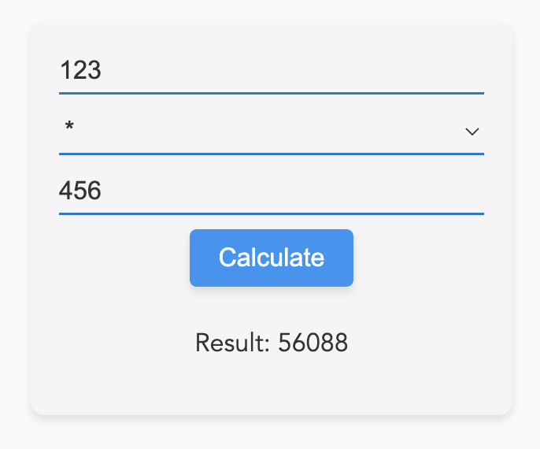

# Simple Calculator

A modern and elegant calculator application built with Vue.js that allows users to perform basic arithmetic operations like addition, subtraction, multiplication, and division. The project demonstrates how to create forms, handle events, and work with data-binding in Vue.js.



## Features

- Basic arithmetic operations: addition, subtraction, multiplication, and division
- Responsive design
- Modern and elegant styling

## Prerequisites

- Node.js
- npm (Node package manager)

## Installation and Setup

1. Clone the repository:

```
git clone https://github.com/your-username/simple-calculator.git
```
2. Navigate to the project folder:
```
cd simple-calculator
```

3. Install the required dependencies:
```
npm install
```

4. Start the development server:
```
npm run serve
```

5. Open your browser and navigate to `http://localhost:8080/` (or the URL provided by the development server) to use the calculator application.

## Contributing

Pull requests are welcome. For major changes, please open an issue first to discuss what you would like to change.

## License

[MIT](https://choosealicense.com/licenses/mit/)
